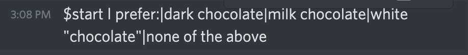
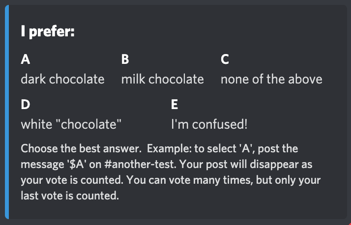
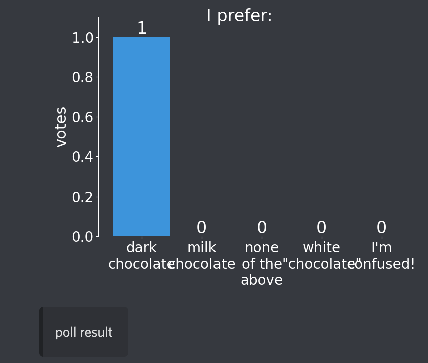

# hermes

A stripped down, clean discord poll bot tailored for the classroom

The goal was to make the presenting poll as simple as possible and the resulting
output easy to understand.  When I use it, I run the poll from an #instructor-only
channel and have the poll prompts and results appear posted on a
student-accessible #in-class channel.

#### Installing
1. clone the repo
2. On the command line, navigate into the `hermes/` directory.
3. Run `python setup.py install`

#### Configuring

+ Create a generic bot account (https://discordpy.readthedocs.io/en/latest/discord.html).  
+ Give it permissions to "Send messages", "Manage message", "Embed Links", and "Attach files".
+ I use "img/hermes.png" as the bot avatar.
+ Invite your new bot to your server and configure it on at least one channel with (at least) the permissions
  above.
+ On your computer, copy "example/config.json" into a working directory.
    + Update the `DISCORD_TOKEN` with your bot password. (WARNING: DO NOT POST THIS FILE WITH THE TOKEN!)
    + Get the [channel id](https://github.com/5andr0/PogoLocationFeeder/issues/64) for the channel on which you wish to run polls and put it into the `POLL_CHANNEL`" field in config.json.
    + If you want to control the bot from a separate channel (which I find useful), update `MASTER_CHANNEL` with the channel id for the channel you want to use to control the poll. Otherwise, set `MASTER_CHANNEL` to the same as your `POLL_CHANNEL`.
+ On the command line, navigate to the folder in which you have config.json and run: `hermes.py config.json`
+ The `hermes` bot should not be up and running on your server.

#### Using

+ Start a poll by sending the message `$start question|answer1|answer2|...` on the master channel.
+ The bot will automatically randomize the order of the answers and append an "I'm confused" option at the end.
+ The poll prompt will appear on the poll channel.
+ Users can vote by typing `$A`, `$B`, etc in the poll channel. There votes disappear as they cast them,
  so it's approximately anonymous and avoids students copying one another's answers.
+ Close the poll by sending the message `$close` on the master channel.
+ A summary graph will then appear on the poll channel.

*Some notes:*
+ Only one poll can be open at once.  
+ After a user invokes the poll with `$start`, only they can run `$close`
+ Errors spit out on the local terminal, not on discord.
+ The poll results are also spit out as .csv files on the local computer.
+ This is **not** designed to be highly secure or tamper proof.  It's a teaching
  tool designed for a generally non-hostile environment.  

*Invocation example*

*Prompt that appears on poll channel*

*Result that appears on the poll channel with the poll is closed*

